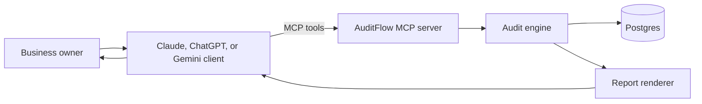
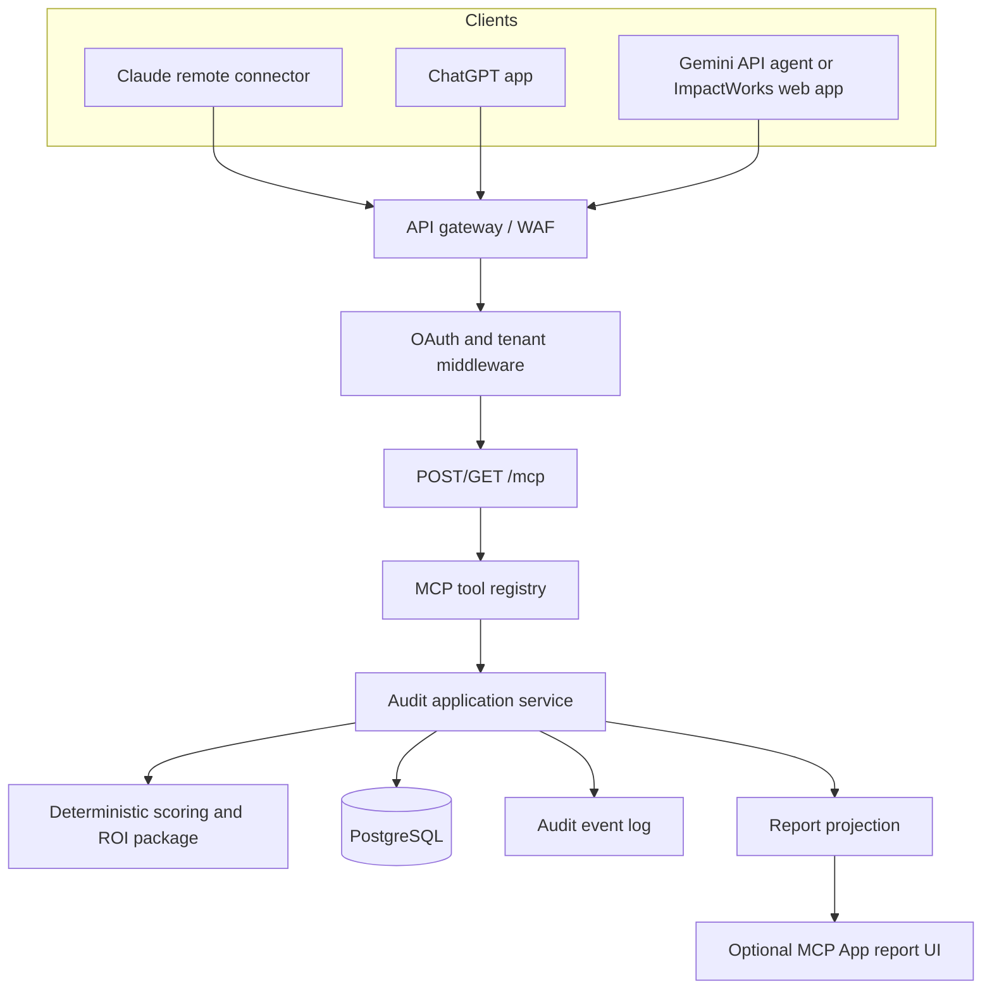

# ImpactWorks AuditFlow

## MVP Technical Build Specification

**Version:** 1.0  
**Status:** Build-ready proposal  
**Product owner:** ImpactWorks / Prime Reset LLC  
**Product promise:** Describe how the business works and receive an evidence-aware AI automation roadmap ranked by impact, feasibility, and ROI.

## 1. Product Boundary

AuditFlow is a multi-tenant remote MCP product for owners and operations leaders at $1M-$20M small and midsize businesses. It interviews the user, records manual workflows, calculates opportunity scores and ROI scenarios, and returns a 90-day implementation roadmap.

The MVP does not connect to a customer's production systems or deploy automations. It analyzes user-supplied information and qualifies suitable opportunities for an ImpactWorks three-week implementation sprint.

### Success criteria

- A first-time user can complete a useful audit in 20-35 minutes.
- Every financial result identifies its assumptions and confidence level.
- A report contains at least three workflows, a ranked opportunity list, ROI scenarios, and a 90-day roadmap.
- The same MCP endpoint works with Claude, ChatGPT, and a Gemini API integration.
- The product converts qualified users to a discovery call or paid implementation sprint without making the report feel like a sales pitch.

### Explicit non-goals for v1

- Autonomous changes to customer software.
- Automated vendor purchasing or account creation.
- Full process mining from event logs.
- Industry-specific regulatory certification.
- Guaranteed savings, revenue, or ROI.
- A native installable connector inside the consumer Gemini app unless Google exposes that distribution path.

## 2. User Experience

The host model conducts the conversation; AuditFlow owns state, calculations, and report generation.



### Golden path

1. Host explains the audit and asks for a business snapshot.
2. Host calls `create_audit`.
3. Host interviews the user about three to seven workflows and calls `upsert_workflow` after each one.
4. Host calls `score_opportunities` when at least three workflows are sufficiently complete.
5. Host confirms uncertain financial assumptions, then calls `estimate_roi` for the top three opportunities.
6. Host calls `recommend_solution_stack` and `generate_roadmap`.
7. Host calls `get_audit_report` and explains the top findings.
8. If sprint fit is strong, host offers an ImpactWorks implementation conversation as the next step.

The host must never calculate or invent official AuditFlow scores. Those values come from the server.

## 3. Canonical MCP Tool Contract

The machine-readable descriptor bundle is in [`impactworks-auditflow-tools.json`](./impactworks-auditflow-tools.json). It contains complete JSON Schema input and output contracts for:

| Tool | Role | State change |
|---|---|---|
| `create_audit` | Creates the tenant-scoped audit and baseline assumptions | Yes |
| `upsert_workflow` | Records one workflow, its steps, volume, time, systems, and evidence quality | Yes |
| `score_opportunities` | Calculates impact, feasibility, risk, confidence, and priority | No |
| `estimate_roi` | Calculates low, expected, and high financial scenarios | No |
| `recommend_solution_stack` | Produces vendor-neutral implementation patterns and controls | No |
| `generate_roadmap` | Persists a sequenced 30/60/90-day plan | Yes |
| `get_audit_report` | Assembles the decision-ready report and sprint-fit assessment | No |

All records are addressed by opaque IDs. Every handler must derive `tenant_id` and `user_id` from the access token, never from model-supplied arguments.

### Tool result envelope

Handlers return standard MCP content plus structured data:

```json
{
  "content": [
    {
      "type": "text",
      "text": "Scored 4 workflows. Two are strong quick-win candidates."
    }
  ],
  "structuredContent": {
    "audit_id": "aud_01JZ6K8M",
    "scoring_version": "iwaf-1.0.0",
    "opportunities": []
  }
}
```

`structuredContent` must validate against the tool's `outputSchema`. Use `_meta` only for UI-only information that the model should not see.

### Error contract

Business errors return `isError: true` with a stable code and a useful recovery action:

```json
{
  "isError": true,
  "content": [
    {
      "type": "text",
      "text": "This audit needs at least three sufficiently complete workflows before scoring."
    }
  ],
  "structuredContent": {
    "error": {
      "code": "INSUFFICIENT_WORKFLOWS",
      "message": "At least three workflows with volume and time data are required.",
      "retryable": true,
      "missing": ["workflow_3.monthly_volume", "workflow_3.minutes_per_run"]
    }
  }
}
```

Required error codes: `UNAUTHORIZED`, `FORBIDDEN`, `AUDIT_NOT_FOUND`, `WORKFLOW_NOT_FOUND`, `VALIDATION_FAILED`, `INSUFFICIENT_WORKFLOWS`, `INSUFFICIENT_EVIDENCE`, `RATE_LIMITED`, and `INTERNAL_ERROR`.

## 4. Sample Tool Responses

### `create_audit`

```json
{
  "audit_id": "aud_01JZ6K8M",
  "status": "intake",
  "missing_fields": ["annual_revenue_usd", "constraints.budget_range_usd"],
  "next_action": "Record the first high-friction workflow."
}
```

### `upsert_workflow`

```json
{
  "audit_id": "aud_01JZ6K8M",
  "workflow_id": "wf_lead_followup",
  "completeness_percent": 86,
  "warnings": [
    "Monthly volume is an owner estimate.",
    "Cost per missed lead is unknown. Revenue uplift will be excluded by default."
  ],
  "next_action": "Record another workflow or confirm the missed-lead value."
}
```

### `score_opportunities`

```json
{
  "audit_id": "aud_01JZ6K8M",
  "scoring_version": "iwaf-1.0.0",
  "opportunities": [
    {
      "workflow_id": "wf_lead_followup",
      "workflow_name": "New lead intake and follow-up",
      "impact_score": 87,
      "feasibility_score": 82,
      "risk_score": 24,
      "confidence_score": 72,
      "priority_score": 81,
      "priority_band": "quick_win",
      "automation_pattern": "agentic_workflow",
      "reasons": [
        "High monthly volume and repeated data entry",
        "Fast response time has a direct commercial impact",
        "The workflow already uses cloud systems with accessible APIs"
      ],
      "blockers": [
        "Lead-routing exceptions need a written decision table"
      ]
    }
  ]
}
```

### `estimate_roi`

```json
{
  "audit_id": "aud_01JZ6K8M",
  "currency": "USD",
  "scenarios": [
    {
      "name": "low",
      "annual_hours_recovered": 312,
      "annual_labor_value_usd": 14040,
      "annual_error_reduction_value_usd": 1800,
      "annual_revenue_uplift_usd": 0,
      "annual_net_benefit_usd": 12840,
      "first_year_roi_percent": 42.7,
      "payback_months": 8.4
    },
    {
      "name": "expected",
      "annual_hours_recovered": 468,
      "annual_labor_value_usd": 21060,
      "annual_error_reduction_value_usd": 3000,
      "annual_revenue_uplift_usd": 0,
      "annual_net_benefit_usd": 21060,
      "first_year_roi_percent": 134.0,
      "payback_months": 4.8
    },
    {
      "name": "high",
      "annual_hours_recovered": 585,
      "annual_labor_value_usd": 26325,
      "annual_error_reduction_value_usd": 4200,
      "annual_revenue_uplift_usd": 0,
      "annual_net_benefit_usd": 27525,
      "first_year_roi_percent": 205.8,
      "payback_months": 3.5
    }
  ],
  "assumptions": [
    "Loaded labor rate: $45/hour",
    "Expected automation coverage: 65%",
    "Expected user adoption: 80%",
    "One-time implementation cost: $9,000",
    "Annual software cost: $3,000"
  ],
  "excluded_benefits": [
    "Revenue uplift from faster lead response",
    "Customer experience improvements",
    "Management time recovered"
  ],
  "confidence": "medium",
  "disclaimer": "These are planning estimates based on supplied assumptions, not guaranteed financial results."
}
```

### `recommend_solution_stack`

```json
{
  "audit_id": "aud_01JZ6K8M",
  "recommendations": [
    {
      "workflow_id": "wf_lead_followup",
      "architecture_pattern": "Event-driven lead intake with rules-based routing, AI-assisted classification, and human escalation",
      "capabilities": ["webhook intake", "CRM sync", "message generation", "SLA timer", "exception queue"],
      "example_products": ["Make", "Zapier", "HubSpot", "OpenAI or Anthropic API"],
      "human_review_points": ["Low-confidence lead classification", "Complaints or legal language", "Quotes above approval threshold"],
      "security_controls": ["Least-privilege OAuth scopes", "PII redaction in logs", "90-day audit log", "Prompt-injection filtering"],
      "implementation_complexity": "medium"
    }
  ]
}
```

### `generate_roadmap`

```json
{
  "audit_id": "aud_01JZ6K8M",
  "roadmap_id": "rm_01JZ74TP",
  "phases": [
    {
      "phase": "days_1_30",
      "objective": "Validate the quick win and establish a reliable baseline.",
      "initiatives": [
        {
          "workflow_id": "wf_lead_followup",
          "deliverable": "Instrument the current process and document lead-routing rules.",
          "owner_role": "Sales operations lead",
          "dependencies": ["CRM admin access", "Two weeks of baseline data"],
          "success_metric": "Baseline response time and conversion rate approved by owner.",
          "decision_gate": "Proceed if at least 80% of leads follow documented routing rules."
        }
      ]
    },
    {
      "phase": "days_31_60",
      "objective": "Launch a controlled automation pilot.",
      "initiatives": []
    },
    {
      "phase": "days_61_90",
      "objective": "Measure results, harden controls, and expand coverage.",
      "initiatives": []
    }
  ],
  "critical_dependencies": ["Named process owner", "CRM sandbox", "Approved messaging policy"],
  "executive_decisions": ["Approve pilot budget", "Set escalation and response-time thresholds"]
}
```

### `get_audit_report`

```json
{
  "audit_id": "aud_01JZ6K8M",
  "report_version": "1.0",
  "generated_at": "2026-07-15T16:00:00Z",
  "status": "decision_ready",
  "business_snapshot": {
    "name": "Northstar HVAC",
    "industry": "Home services",
    "employee_count": 28,
    "primary_goal": "increase_capacity"
  },
  "executive_summary": "The audit identified two quick wins and one strategic automation opportunity. Lead follow-up is the strongest first project because it combines measurable labor savings with faster customer response and manageable implementation risk.",
  "top_opportunities": [
    {
      "rank": 1,
      "workflow_id": "wf_lead_followup",
      "name": "New lead intake and follow-up",
      "priority_score": 81,
      "expected_annual_net_benefit_usd": 21060
    }
  ],
  "roi_summary": {
    "expected_annual_net_benefit_usd": 38600,
    "expected_first_year_roi_percent": 121,
    "confidence": "medium"
  },
  "roadmap_summary": {
    "first_move": "Instrument and pilot lead follow-up automation",
    "days": 90,
    "max_parallel_initiatives": 2
  },
  "evidence_gaps": ["Validate lead volume from CRM export", "Measure current first-response time"],
  "risks": ["Routing exceptions are not yet documented", "No designated automation owner"],
  "sprint_fit": {
    "qualified": true,
    "fit_score": 84,
    "recommended_sprint": "ImpactWorks Automation Sprint",
    "scope": ["Lead intake", "Classification", "Routing", "Follow-up", "Exception dashboard"],
    "reasons": ["Bounded workflow", "Clear business owner", "Measurable baseline", "Expected payback under six months"],
    "next_step": "Review the proposed sprint scope with an ImpactWorks automation strategist."
  }
}
```

## 5. Scoring and ROI Logic

Calculations belong in versioned application code, not an LLM prompt. Store raw inputs, normalized values, formula version, and result together so every report is reproducible.

### Opportunity scoring

Each component is normalized to 0-100.

```text
impact =
  0.30 * labor_value_score +
  0.20 * volume_score +
  0.20 * error_cost_score +
  0.15 * customer_impact_score +
  0.15 * revenue_impact_score

feasibility =
  0.25 * rule_clarity_score +
  0.20 * digital_input_score +
  0.20 * integration_readiness_score +
  0.15 * data_quality_score +
  0.10 * process_stability_score +
  0.10 * owner_readiness_score

priority = clamp(
  0.50 * impact +
  0.30 * feasibility +
  0.20 * confidence -
  0.20 * risk,
  0,
  100
)
```

Banding:

- `quick_win`: priority >= 70, feasibility >= 65, risk < 60.
- `strategic_bet`: impact >= 75, but feasibility < 65 or risk >= 60.
- `foundation_first`: priority 45-69 and blocked by data, process, or ownership readiness.
- `defer`: priority < 45 or automation is inappropriate.

Confidence starts from evidence quality (`measured` 90, `owner_estimate` 70, `team_estimate` 60, `unknown` 30) and falls by five points for each missing material financial input, to a minimum of 10.

### ROI scenarios

```text
annual_hours_recovered =
  monthly_volume * minutes_per_run / 60 * 12
  * automation_coverage * adoption_rate

annual_labor_value = annual_hours_recovered * loaded_hourly_rate

annual_error_value =
  monthly_volume * 12 * current_error_rate
  * expected_error_reduction * cost_per_error

annual_net_benefit =
  annual_labor_value + annual_error_value + annual_revenue_uplift
  - annual_software_cost

first_year_roi =
  (annual_net_benefit - implementation_cost) / implementation_cost * 100

payback_months =
  implementation_cost / (annual_net_benefit / 12)
```

Default scenario multipliers:

| Variable | Low | Expected | High |
|---|---:|---:|---:|
| Automation coverage | 45% | 65% | 80% |
| Adoption rate | 70% | 80% | 90% |
| Error reduction | 30% | 50% | 70% |

Revenue uplift is zero unless the user provides a defensible value and explicitly enables it. If implementation cost is zero or absent, return `null` for ROI and payback rather than dividing by zero or implying infinite returns.

## 6. Prompt and Orchestration Logic

The server publishes tools; each host supplies its own system instruction. Keep the core policy text identical across platforms.

### Core system prompt

```text
You are ImpactWorks AuditFlow, an AI automation audit specialist for small and
midsize businesses. Your job is to understand how work actually moves through
the business, identify sensible automation opportunities, and build an
evidence-aware implementation roadmap.

Operating rules:
1. Start with the business outcome, not technology.
2. Ask no more than three concise questions at a time.
3. Separate measured facts, user estimates, AuditFlow defaults, and unknowns.
4. Record each material workflow with upsert_workflow before analyzing it.
5. Do not invent official scores, ROI, or report values. Call AuditFlow tools.
6. Do not recommend automating a broken, unstable, unsafe, or rarely repeated
   process without first recommending the required foundation work.
7. Prefer the least complex approach that achieves the outcome. AI is not
   automatically better than rules, integrations, templates, or process fixes.
8. Preserve human review for financial commitments, regulated data, safety,
   legal decisions, sensitive communications, and low-confidence outputs.
9. Describe financial outputs as scenarios, not guarantees, and repeat material
   assumptions near the result.
10. Give value before mentioning ImpactWorks services. Offer a sprint only when
    get_audit_report marks the audit qualified.

Conversation stages:
- DISCOVER: Explain the audit and collect the business snapshot.
- INVENTORY: Capture 3-7 high-friction workflows.
- VALIDATE: Resolve missing high-impact inputs and label remaining uncertainty.
- ANALYZE: Score opportunities and estimate ROI for the strongest candidates.
- ROADMAP: Recommend an approach and create the 90-day sequence.
- REPORT: Generate and explain the report, then offer the next best action.
```

### Tool selection policy

```text
If no audit_id exists -> create_audit.
If the user describes a new workflow or corrects one -> upsert_workflow.
If fewer than 3 complete workflows exist -> continue inventory.
If 3+ workflows exist but material fields are missing -> ask targeted questions.
If prioritization is requested -> score_opportunities.
If financial value is requested -> confirm assumptions, then estimate_roi.
If implementation approach is requested -> recommend_solution_stack.
If sequencing is requested or analysis is complete -> generate_roadmap.
If a summary, deliverable, or final recommendation is requested -> get_audit_report.
```

### Conversation state

The host conversation is not the source of truth. After each tool call, the server persists an `audit_event`. The host only needs the current `audit_id`; handlers load all other state from storage.

The report is `decision_ready` only when:

- At least three workflows are recorded.
- At least two workflows have completeness >= 70%.
- Opportunity scoring has run on the current workflow revisions.
- At least one ROI estimate exists or the report explicitly states why ROI cannot be calculated.
- A roadmap exists.
- Every high-risk or regulated workflow has a human-review note.

## 7. V1 Server Architecture

### Recommended stack

- TypeScript 5.x on Node.js 22 LTS.
- Official MCP TypeScript SDK with stateless Streamable HTTP.
- Fastify or Hono for HTTP routing and middleware.
- PostgreSQL for tenant, audit, workflow, score, estimate, roadmap, and event data.
- Zod as the runtime schema source, exported to JSON Schema for descriptors.
- OAuth 2.1 authorization-code flow with PKCE for user installs.
- Managed object storage for rendered PDF reports in a later minor release.
- OpenTelemetry traces plus structured JSON logs with PII redaction.



### Repository layout

```text
auditflow/
  apps/
    mcp-server/
      src/http.ts
      src/auth.ts
      src/server.ts
    report-ui/
      src/App.tsx
  packages/
    tool-contracts/
      src/tools.ts
      generated/tools.json
    audit-domain/
      src/entities.ts
      src/policies.ts
    scoring-engine/
      src/opportunity-score.ts
      src/roi.ts
      src/scenarios.ts
    application/
      src/audit-service.ts
      src/report-service.ts
    persistence/
      src/repositories.ts
      migrations/
    observability/
  tests/
    contract/
    integration/
    evals/
```

### Core data tables

| Table | Key fields |
|---|---|
| `tenants` | `id`, `name`, `plan`, `status` |
| `users` | `id`, `tenant_id`, `external_subject`, `role` |
| `audits` | `id`, `tenant_id`, `created_by`, `status`, `business_json`, `constraints_json` |
| `workflows` | `id`, `audit_id`, `revision`, `workflow_json`, `completeness`, `evidence_quality` |
| `opportunity_scores` | `audit_id`, `workflow_id`, `workflow_revision`, `formula_version`, component scores |
| `roi_estimates` | `id`, `audit_id`, `input_hash`, `formula_version`, scenarios JSON |
| `roadmaps` | `id`, `audit_id`, `revision`, `roadmap_json` |
| `audit_events` | `id`, `audit_id`, `actor_id`, `event_type`, `payload_json`, `created_at` |

Use row-level tenant checks in repositories even if the API middleware already verified the tenant. Never accept a `tenant_id` argument from an MCP tool call.

### HTTP surface

| Method | Path | Purpose |
|---|---|---|
| `GET` / `POST` / `DELETE` | `/mcp` | Streamable HTTP transport |
| `GET` | `/.well-known/oauth-authorization-server` | OAuth metadata |
| `GET` | `/.well-known/oauth-protected-resource` | Protected resource metadata |
| `GET` / `POST` | `/oauth/authorize` | Authorization and consent |
| `POST` | `/oauth/token` | Code exchange and refresh |
| `GET` | `/health/live` | Process liveness only |
| `GET` | `/health/ready` | Database and dependency readiness |

Production requirements include TLS, exact origin allowlisting, request size limits, per-user and per-tenant rate limits, token audience validation, rotating signing keys, replay protection, and encrypted secrets. Logs must never contain access tokens, workflow free text, or full tool payloads.

## 8. Platform Integration

### Claude

Distribution: remote custom connector in Claude. The MCP endpoint must be publicly reachable because Claude connects from Anthropic infrastructure. Users add the URL and complete OAuth. Team and Enterprise owners may need to register the connector before members enable it.

Use the canonical seven tools with standard MCP descriptions. The optional report UI can use the MCP Apps standard, but v1 must remain fully usable as structured text if the host does not render the component.

### ChatGPT

Distribution: ChatGPT app backed by the same remote MCP server. Add an optional report component linked from `get_audit_report` using `_meta.ui.resourceUri`; keep all business logic on the server.

ChatGPT-specific metadata is additive:

- Declare `outputSchema` whenever returning `structuredContent`.
- Set tool annotations accurately for read-only and state-changing tools.
- Keep report hydration data that the model should not see inside result `_meta`.
- Do not use host-provided location or user-agent hints for authorization.
- Make the app useful without the component so the core tools remain portable.

### Gemini

Distribution for v1: an ImpactWorks-hosted web experience or managed agent using the Gemini Interactions API and the same remote MCP endpoint. Configure the server name as `impactworks_auditflow` because Google's current remote-MCP guidance uses snake_case and Streamable HTTP.

This is not equivalent to a universally installable connector in the consumer Gemini chat product. Keep a thin fallback adapter that converts the canonical tool schemas into Gemini function declarations and forwards function calls to the same application service. This protects the product from model-specific remote-MCP limitations without forking business logic.

```text
Canonical tool contract
        |-- MCP Streamable HTTP --> Claude
        |-- MCP + optional UI ----> ChatGPT
        |-- MCP Streamable HTTP --> Gemini API when supported
        `-- Function adapter ------> Gemini API fallback
```

## 9. Security, Privacy, and Trust

- Default to the least sensitive workflow description needed for analysis.
- Display a warning before users enter health, financial-account, legal, or other regulated personal data.
- Encrypt database and backups; use field-level encryption for sensitive notes if retained.
- Offer configurable retention, with 30 days for trial audits and customer-controlled retention for paid plans.
- Make audit deletion self-service and cascade to workflows, estimates, reports, and object storage.
- Treat all workflow text as untrusted input. It must never change system policy or tool permissions.
- Require explicit user confirmation before sending report data to a CRM or booking system in a later release.
- Record formula versions and assumption changes in the event log.
- Add dependency scanning, secret scanning, and contract tests to CI.

## 10. Verification and Launch Gates

### Automated tests

- JSON Schema validation for every sample request and response.
- Cross-tenant access tests for every repository method.
- Golden tests for scoring formulas, including boundary bands.
- ROI tests for zero cost, missing values, negative net benefit, and extreme inputs.
- Idempotency tests for `upsert_workflow` and `generate_roadmap`.
- MCP initialize, tools/list, and tools/call contract tests over Streamable HTTP.
- OAuth happy path, token expiry, refresh, wrong audience, revoked grant, and PKCE failure tests.
- Snapshot tests showing standard fields work when all ChatGPT-specific `_meta` fields are removed.

### Quality evals

Create at least 30 synthetic audits across home services, medical practices, professional services, retail, and multi-location businesses. Score each conversation on:

- Question efficiency.
- Correct separation of facts, estimates, defaults, and unknowns.
- Appropriate refusal to automate unsafe decisions.
- Tool selection and call ordering.
- Numerical faithfulness to tool results.
- Roadmap practicality.
- Sales restraint and correct sprint qualification.

### Launch gates

- 100% of tool outputs validate against their declared schemas.
- No critical or high security findings.
- Zero cross-tenant access in automated tests.
- At least 90% tool-selection accuracy on the eval set.
- At least 95% numerical faithfulness to server-calculated values.
- Median self-serve completion time below 35 minutes in ten moderated pilots.

## 11. Build Sequence

### Sprint 1: Audit engine

Implement auth, tenancy, audit/workflow persistence, completeness checks, deterministic scoring, ROI scenarios, and contract tests.

### Sprint 2: MCP product

Implement the seven MCP handlers, Streamable HTTP deployment, report projection, prompt/eval harness, and Claude connector testing.

### Sprint 3: Distribution

Add the ChatGPT report component and app metadata, the Gemini API adapter, production telemetry, billing entitlements, and moderated pilot fixes.

## 12. Current Platform References

- [OpenAI Apps SDK: Build your MCP server](https://developers.openai.com/apps-sdk/build/mcp-server)
- [OpenAI Apps SDK reference](https://developers.openai.com/apps-sdk/reference)
- [Claude custom connectors using remote MCP](https://support.claude.com/en/articles/11175166-get-started-with-custom-connectors-using-remote-mcp)
- [Gemini function calling and remote MCP](https://ai.google.dev/gemini-api/docs/function-calling)
- [MCP Streamable HTTP transport](https://modelcontextprotocol.io/specification/2025-11-25/basic/transports)
- [MCP authorization](https://modelcontextprotocol.io/specification/2025-03-26/basic/authorization)

Platform support changes quickly. Recheck these references immediately before implementation and app submission.
